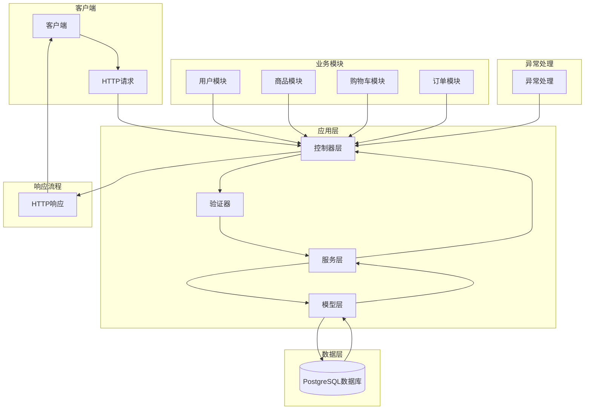
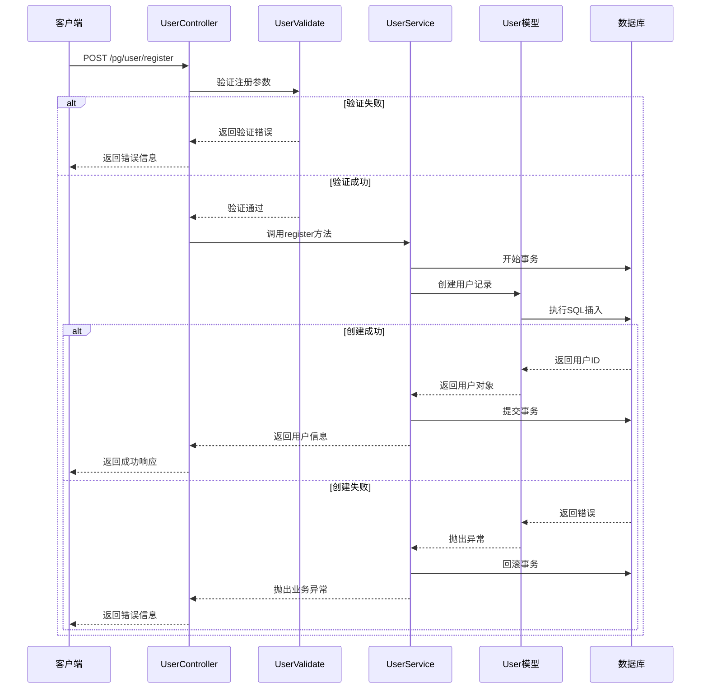
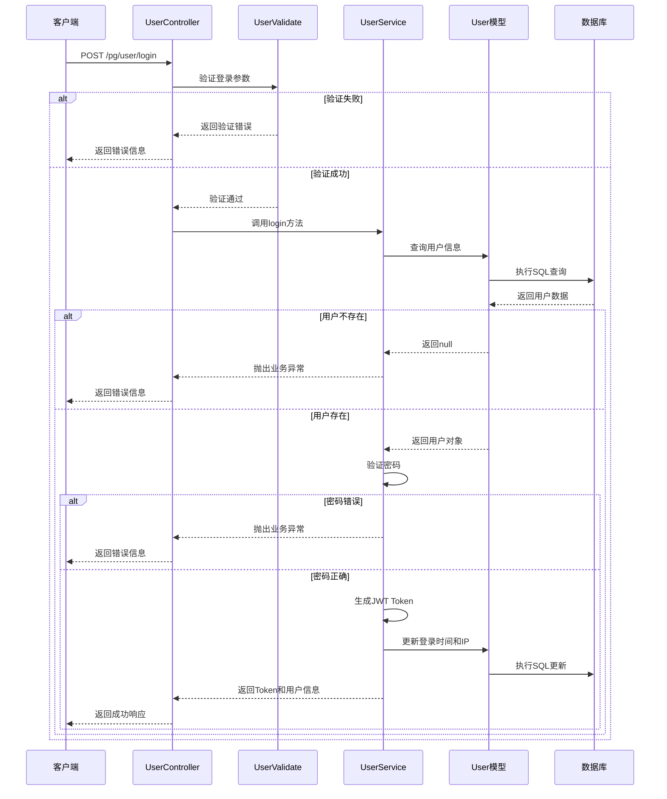
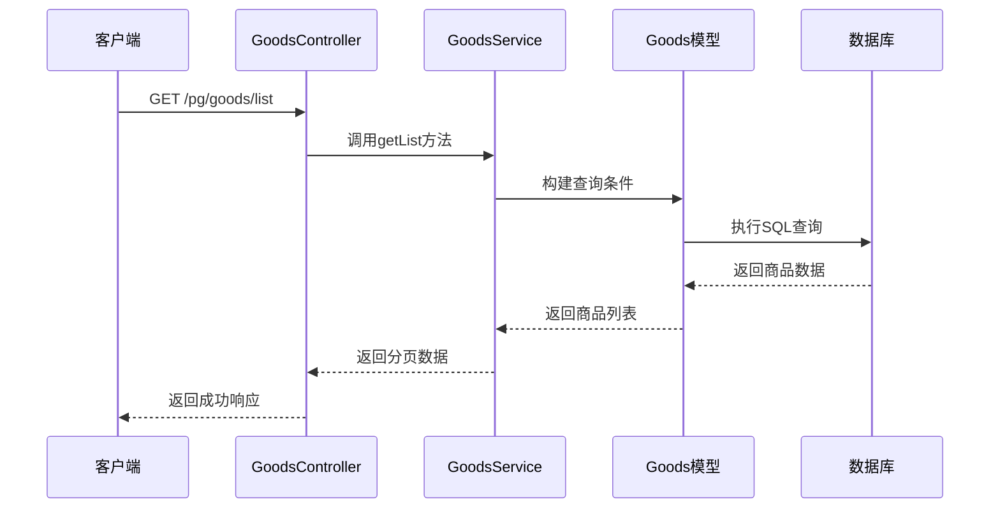
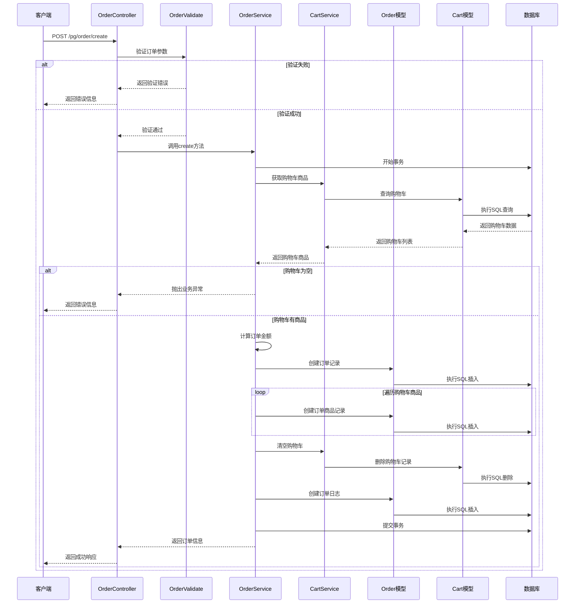

# 系统流程图

本文档提供了电子商务应用的系统流程图，帮助开发者理解系统架构和数据流向。

## 系统架构流程图

下图展示了系统的整体架构和数据流向：

```mermaid
graph TD
    subgraph 客户端
        Client[客户端] --> Request[HTTP请求]
    end

    subgraph 应用层
        Request --> C[控制器层]
        C --> V[验证器]
        V --> S[服务层]
        S --> M[模型层]
    end

    subgraph 数据层
        M --> DB[(PostgreSQL数据库)]
    end

    subgraph 响应流程
        DB --> M
        M --> S
        S --> C
        C --> Response[HTTP响应]
        Response --> Client
    end

    subgraph 业务模块
        UM[用户模块] --> C
        GM[商品模块] --> C
        CM[购物车模块] --> C
        OM[订单模块] --> C
    end

    subgraph 异常处理
        E[异常处理] --> C
    end
```

## 用户注册流程图

下图展示了用户注册的详细流程：

```mermaid
sequenceDiagram
    participant Client as 客户端
    participant Controller as UserController
    participant Validate as UserValidate
    participant Service as UserService
    participant Model as User模型
    participant DB as 数据库

    Client->>Controller: POST /pg/user/register
    Controller->>Validate: 验证注册参数
    
    alt 验证失败
        Validate-->>Controller: 返回验证错误
        Controller-->>Client: 返回错误信息
    else 验证成功
        Validate-->>Controller: 验证通过
        Controller->>Service: 调用register方法
        
        Service->>DB: 开始事务
        Service->>Model: 创建用户记录
        Model->>DB: 执行SQL插入
        
        alt 创建成功
            DB-->>Model: 返回用户ID
            Model-->>Service: 返回用户对象
            Service->>DB: 提交事务
            Service-->>Controller: 返回用户信息
            Controller-->>Client: 返回成功响应
        else 创建失败
            DB-->>Model: 返回错误
            Model-->>Service: 抛出异常
            Service->>DB: 回滚事务
            Service-->>Controller: 抛出业务异常
            Controller-->>Client: 返回错误信息
        end
    end
```

## 登录流程图

下图展示了用户登录的详细流程：

```mermaid
sequenceDiagram
    participant Client as 客户端
    participant Controller as UserController
    participant Validate as UserValidate
    participant Service as UserService
    participant Model as User模型
    participant DB as 数据库

    Client->>Controller: POST /pg/user/login
    Controller->>Validate: 验证登录参数
    
    alt 验证失败
        Validate-->>Controller: 返回验证错误
        Controller-->>Client: 返回错误信息
    else 验证成功
        Validate-->>Controller: 验证通过
        Controller->>Service: 调用login方法
        
        Service->>Model: 查询用户信息
        Model->>DB: 执行SQL查询
        DB-->>Model: 返回用户数据
        
        alt 用户不存在
            Model-->>Service: 返回null
            Service-->>Controller: 抛出业务异常
            Controller-->>Client: 返回错误信息
        else 用户存在
            Model-->>Service: 返回用户对象
            Service->>Service: 验证密码
            
            alt 密码错误
                Service-->>Controller: 抛出业务异常
                Controller-->>Client: 返回错误信息
            else 密码正确
                Service->>Service: 生成JWT Token
                Service->>Model: 更新登录时间和IP
                Model->>DB: 执行SQL更新
                Service-->>Controller: 返回Token和用户信息
                Controller-->>Client: 返回成功响应
            end
        end
    end
```

## 商品列表流程图

下图展示了获取商品列表的详细流程：

```mermaid
sequenceDiagram
    participant Client as 客户端
    participant Controller as GoodsController
    participant Service as GoodsService
    participant Model as Goods模型
    participant DB as 数据库

    Client->>Controller: GET /pg/goods/list
    Controller->>Service: 调用getList方法
    
    Service->>Model: 构建查询条件
    Model->>DB: 执行SQL查询
    DB-->>Model: 返回商品数据
    Model-->>Service: 返回商品列表
    Service-->>Controller: 返回分页数据
    Controller-->>Client: 返回成功响应
```

## 下单流程图

下图展示了创建订单的详细流程：

```mermaid
sequenceDiagram
    participant Client as 客户端
    participant Controller as OrderController
    participant Validate as OrderValidate
    participant Service as OrderService
    participant CartService as CartService
    participant OrderModel as Order模型
    participant CartModel as Cart模型
    participant DB as 数据库

    Client->>Controller: POST /pg/order/create
    Controller->>Validate: 验证订单参数
    
    alt 验证失败
        Validate-->>Controller: 返回验证错误
        Controller-->>Client: 返回错误信息
    else 验证成功
        Validate-->>Controller: 验证通过
        Controller->>Service: 调用create方法
        
        Service->>DB: 开始事务
        Service->>CartService: 获取购物车商品
        CartService->>CartModel: 查询购物车
        CartModel->>DB: 执行SQL查询
        DB-->>CartModel: 返回购物车数据
        CartModel-->>CartService: 返回购物车列表
        CartService-->>Service: 返回购物车商品
        
        alt 购物车为空
            Service-->>Controller: 抛出业务异常
            Controller-->>Client: 返回错误信息
        else 购物车有商品
            Service->>Service: 计算订单金额
            Service->>OrderModel: 创建订单记录
            OrderModel->>DB: 执行SQL插入
            
            loop 遍历购物车商品
                Service->>OrderModel: 创建订单商品记录
                OrderModel->>DB: 执行SQL插入
            end
            
            Service->>CartService: 清空购物车
            CartService->>CartModel: 删除购物车记录
            CartModel->>DB: 执行SQL删除
            
            Service->>OrderModel: 创建订单日志
            OrderModel->>DB: 执行SQL插入
            
            Service->>DB: 提交事务
            Service-->>Controller: 返回订单信息
            Controller-->>Client: 返回成功响应
        end
    end
``` 